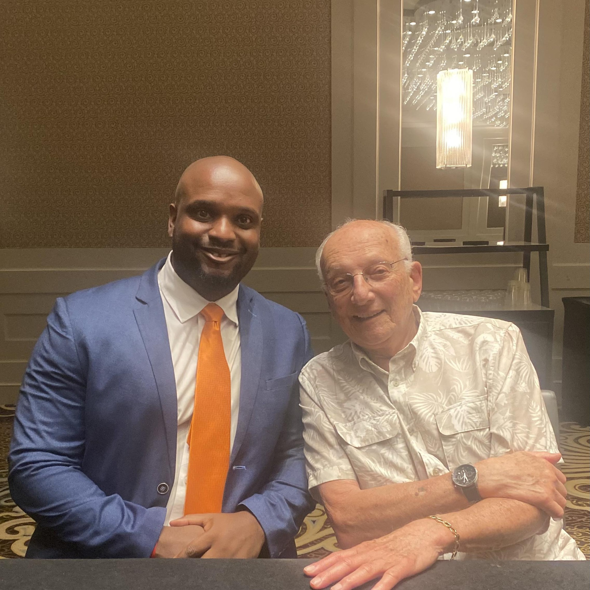
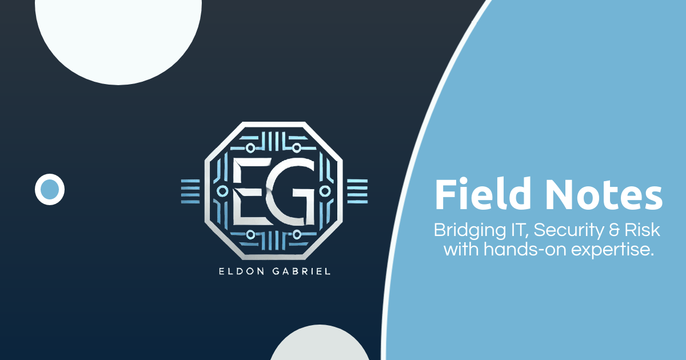

  <h1 style="display: inline-block; width: 50%; border-bottom: 3px solid #fff; padding-bottom: 4px;">Overview</h1>

I'm Eldon, an ISC2 Certified in Cybersecurity professional specializing in system administration and security operations. I approach cybersecurity as both a technical craft and a business-critical discipline, focusing on its foundations with the understanding that no computer network is ever truly secure.

Through my hands-on work, I’ve gained practical experience in risk assessment, incident investigation, system hardening, and digital forensics. My projects cover key areas like Governance, Risk, and Compliance (GRC), Threat Hunting, and Penetration Testing. I apply these skills using tools like Nmap, Wireshark, YARA, OpenVAS, and Burp Suite in real-world virtualized lab environments.

I'm currently advancing my skills through the MSAF course at the Mossé Cyber Security Institute, aiming to bring a risk-focused mindset and practical insight to strengthen organizational defenses.

--- 
 

  <h1 style="display: inline-block; width: 50%; border-bottom: 3px solid #fff; padding-bottom: 4px;">Key Influences and Lessons</h1>

My journey from business to cybersecurity has been shaped by hands-on technical work and lessons learned from remarkable people along the way. These experiences taught me leadership, resilience, and strategic thinking—skills I now apply to building secure networks, hunting threats, and developing proactive defenses.

  

     
    <strong>George H. Ross</strong> 
    <em>NBC’s ‘The Apprentice’ Judge & Mentor</em>
  

  

    
Instilled disciplined evaluation of risks, persistence, and thorough investigative practices essential for threat hunting and incident response.

  

  

     
    <strong>Bruny Surin</strong> 
    <em>Canadian Olympic Gold Medalist</em>
  

  

    
Taught discipline, focus, and composure under pressure—applied to high-stakes incident handling and complex security investigations.

  

  

     
    <strong>Wahida Clark</strong> 
    <em>4x NYT Bestselling Author</em>
  

  

    
Reinforced the importance of clear communication and storytelling to explain complex technical risks to non-technical audiences.

  

  

     
    <strong>Alex Clark</strong> 
    <em>CEO, Quantum Pigeon Technologies Inc.</em>
  

  

    
Highlighted the value of forward-thinking innovation and staying ahead of emerging technology trends, crucial for proactive cybersecurity defenses.

  

  

     
    <strong>Stedman Graham</strong> 
    <em>Businessman & Author</em>
  

  

    
Emphasized clarity of purpose and strategic thinking, helping to stay focused and intentional in building cybersecurity expertise and projects.

  

I’ve also learned from other leaders across industries, each shaping my approach to cybersecurity with lessons in strategic thinking, innovation, and resilience. I bring to every challenge technical rigor, strategic insight, and clear communication. Whether investigating incidents, hardening systems, or assessing risks, I apply a mindset shaped by practical experience, mentorship, and continuous learning.

--- 
 

  <h1 style="display: inline-block; width: 50%; border-bottom: 3px solid #fff; padding-bottom: 5px;">Cybersecurity Reports</h1>

  <figure style="flex: 1; min-width: 300px; max-width: 600px; text-align: center;">
    <iframe class="pdf-embed" 
            src="{{ '/assets/reports/REPORT – Bank Risk Register Analysis – v1.0.2.pdf' | relative_url }}" 
            width="100%" height="700px" style="border:1px solid #ccc;"></iframe>
    <figcaption>REPORT – Bank Risk Register Analysis – v1.0.2</figcaption>
  </figure>

  <figure style="flex: 1; min-width: 300px; max-width: 600px; text-align: center;">
    <iframe class="pdf-embed" 
            src="{{ '/assets/reports/REPORT – Investigation of Unauthorized Payroll Access Incident - v1.2.0.pdf' | relative_url }}" 
            width="100%" height="700px" style="border:1px solid #ccc;"></iframe>
    <figcaption>REPORT – Investigation of Unauthorized Payroll Access Incident - v1.2.0</figcaption>
  </figure>

 

  <figure style="flex: 1; min-width: 300px; max-width: 600px; text-align: center;">
    <iframe class="pdf-embed" 
            src="{{ '/assets/reports/REPORT – Server Security Evaluation – v1.2.0.pdf' | relative_url }}" 
            width="100%" height="700px" style="border:1px solid #ccc;"></iframe>
    <figcaption>REPORT – Server Security Evaluation – v1.2.0</figcaption>
  </figure>

  <figure style="flex: 1; min-width: 300px; max-width: 600px; text-align: center;">
    <iframe class="pdf-embed" 
            src="{{ '/assets/guides/GUIDE – Enterprise IPsec VPN Troubleshooting – v1.0.0.pdf' | relative_url }}" 
            width="100%" height="700px" style="border:1px solid #ccc;"></iframe>
    <figcaption>GUIDE – Enterprise IPsec VPN Troubleshooting – v1.0.0</figcaption>
  </figure>

--- 
 

  <h1 style="display: inline-block; width: 50%; border-bottom: 3px solid #fff; padding-bottom: 5px;">Certifications</h1>

  <!-- Slide 1 -->
  

    
1 / 10

    
    

  

  <!-- Slide 2 -->
  

    
2 / 10

    
    

  

  <!-- Slide 3 -->
  

    
3 / 10

    
    

  

  <!-- Slide 4 -->
  

    
4 / 10

    
    

  

  <!-- Slide 5 -->
  

    
5 / 10

    
    

  

  <!-- Slide 6 -->
  

    
6 / 10

    
    

  

  <!-- Slide 7 -->
  

    
7 / 10

    
    

  

  <!-- Slide 8 -->
  

    
8 / 10

    
    

  

  <!-- Slide 9 -->
  

    
9 / 10

    
    

  

  <!-- Slide 10 -->
  

    
10 / 10

    
    

  

 

   
   
   
   
   
   
   
   
   
   

--- 
 

  <h1 style="display: inline-block; width: 50%; border-bottom: 3px solid #fff; padding-bottom: 5px;">Future Certifications</h1>

  <table cellspacing="10" cellpadding="5" style="border-collapse: collapse; width: 100%; text-align: center;">
    <thead>
      <tr style="background-color: #73b4d5; color: #000000;">
        <th style="text-align: center;">Certification Name</th>
        <th style="text-align: center;">Issuing Organization</th>
        <th style="text-align: center;">Status</th>
      </tr>
    </thead>
    <tbody>
      <tr>
        <td>MSAF – System Administration Fundamentals⭐</td>
        <td>Mossé Cyber Security Institute</td>
        <td>In Progress</td>
      </tr>
      <tr>
        <td>Enterprise System Management and Security</td>
        <td>University of Colorado</td>
        <td>In Progress</td>
      </tr>
    </tbody>
  </table>

⭐ MCSI certifications align with NIST National Initiative for Cybersecurity Education (NICE), US Military Occupational Specialties (MOS), and Australian Signals Directorate (ASD) Cyber Skills Framework.

***
 

Field Notes documents my journey in cybersecurity, highlighting real-world projects, technical problem-solving, and applied skills that showcase my ability to bridge IT fundamentals with security operations.
