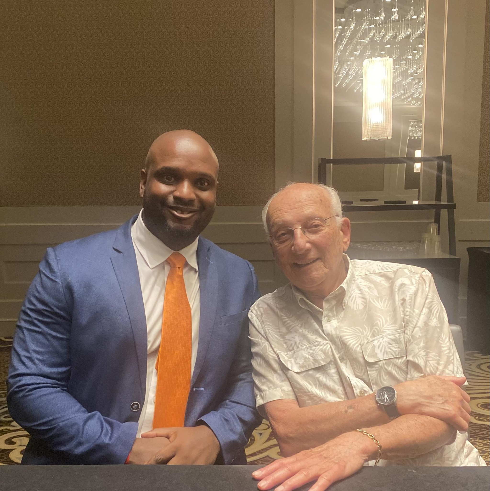
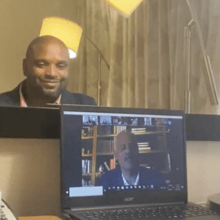
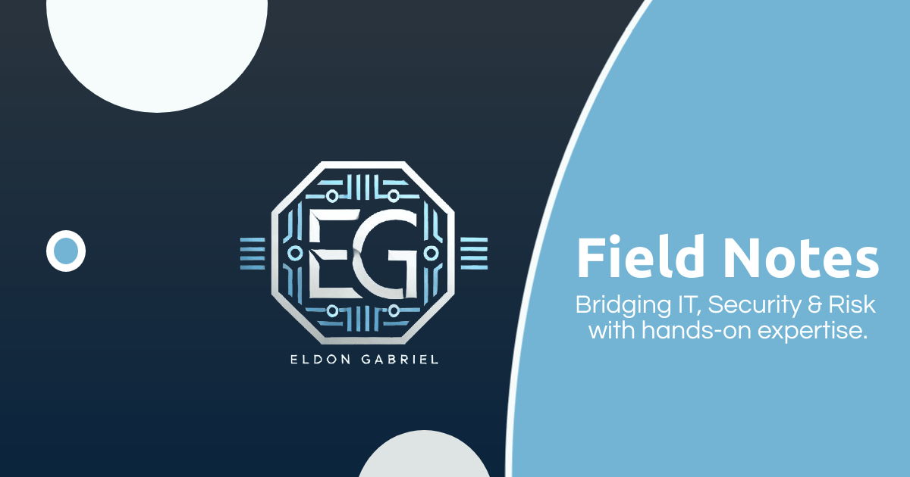

<!-- Insights Header -->
<section style="text-align:center; margin: 60px 0;">
  <h2 style="display:inline-block; position:relative; font-size:2.5em; margin:0; padding-bottom:10px;">
    Insights
    
  </h2>
</section>

I'm <strong>Eldon Gabriel</strong>, an <strong>ISC² Certified Cybersecurity Professional</strong> with hands-on experience securing and managing Windows and Linux environments through real-world labs, projects, and structured training under the MSAF (System Administration Fundamentals) program. My work focuses on system hardening, network security, troubleshooting, and defensive security operations.

I also completed the Mercor Red Teaming Academy, where I gained experience in AI safety concepts, threat modeling, and practical red-teaming exercises, including a live evaluation-based red team assessment. In addition, I completed an AI dataset training project, which strengthened my attention to detail, analytical thinking, and ability to work with structured technical data.

With 100+ labs and reports completed, I focus on practical skills that support secure IT operations, incident response readiness, and real-world cybersecurity problem solving.

    <a href="/certifications/" style="text-decoration: none; display: inline-block; padding: 12px 24px; font-weight: bold; border-radius: 5px; background-color: #73b4d5; color: #000; border: 2px solid #73b4d5; transition: background-color 0.3s, color 0.3s;">
      View All Certifications
    </a>
    <a href="/experience/" style="text-decoration: none; display: inline-block; padding: 12px 24px; font-weight: bold; border-radius: 5px; background-color: #73b4d5; color: #000; border: 2px solid #73b4d5; transition: background-color 0.3s, color 0.3s;">
      View Hands-On Labs
    </a>

---

<!-- Key Influences and Lessons Header -->
<section style="text-align:center; margin: 60px 0;">
  <h2 style="display:inline-block; position:relative; font-size:2.5em; margin:0; padding-bottom:10px;">
    Key Influences and Lessons
    
  </h2>
</section>

My journey from business to cybersecurity has been shaped by hands-on technical work and lessons learned from remarkable people along the way. These experiences taught me <strong>leadership</strong>, <strong>resilience</strong>, and <strong>strategic thinking</strong>—skills I now apply to building secure networks, hunting threats, and developing proactive defenses.

  

     
    <strong>George H. Ross</strong> 
    <em>NBC’s ‘The Apprentice’ Judge & Mentor</em>
  

  

    
Instilled <strong>disciplined evaluation of risks</strong>, persistence, and thorough investigative practices essential for <strong>threat hunting</strong> and <strong>incident response</strong>.

  

  

     
    <strong>Bruny Surin</strong> 
    <em>Canadian Olympic Gold Medalist</em>
  

  

    
Taught <strong>discipline, focus, and composure under pressure</strong>—applied to high-stakes <strong>incident handling</strong> and complex <strong>security investigations</strong>.

  

  

     
    <strong>Wahida Clark</strong> 
    <em>4x NYT Bestselling Author</em>
  

  

    
Reinforced the importance of <strong>clear communication</strong> and <strong>storytelling</strong> to explain complex technical risks to non-technical audiences.

  

  

     
    <strong>Alex Clark</strong> 
    <em>CEO, Quantum Pigeon Technologies Inc.</em>
  

  

    
Highlighted the value of <strong>forward-thinking innovation</strong> and staying ahead of emerging technology trends, crucial for proactive cybersecurity defenses.

  

  

     
    <strong>Stedman Graham</strong> 
    <em>Businessman & Author</em>
  

  

    
Emphasized <strong>clarity of purpose</strong> and <strong>strategic thinking</strong>, helping to stay focused and intentional in building cybersecurity expertise and projects.

  

I’ve also learned from other leaders across industries, each shaping my approach to cybersecurity with lessons in <strong>strategic thinking</strong>, <strong>innovation</strong>, and <strong>resilience</strong>. I bring to every challenge <strong>technical rigor</strong>, <strong>strategic insight</strong>, and <strong>clear communication</strong>. Whether investigating incidents, hardening systems, or assessing risks, I apply a mindset shaped by <em>practical experience, mentorship, and continuous learning</em>.

--- 

<!-- Cybersecurity Report Highlights -->
<section style="text-align:center; margin: 60px 0;">
  <h2 style="display:inline-block; position:relative; font-size:2.5em; margin:0; padding-bottom:10px;">
    Cybersecurity Report Highlights
    
  </h2>
</section>

  <figure style="flex: 1; min-width: 300px; max-width: 600px; text-align: center;">
    <iframe class="pdf-embed" 
            src="{{ '/assets/reports/REPORT – Bank Risk Register Analysis – v1.0.2.pdf' | relative_url }}" 
            width="100%" height="700px" style="border:1px solid #ccc;"></iframe>
    <figcaption>REPORT – Bank Risk Register Analysis – v1.0.2</figcaption>
  </figure>

  <figure style="flex: 1; min-width: 300px; max-width: 600px; text-align: center;">
    <iframe class="pdf-embed" 
            src="{{ '/assets/reports/REPORT – Investigation of Unauthorized Payroll Access Incident - v1.2.0.pdf' | relative_url }}" 
            width="100%" height="700px" style="border:1px solid #ccc;"></iframe>
    <figcaption>REPORT – Investigation of Unauthorized Payroll Access Incident - v1.2.0</figcaption>
  </figure>

 

  <figure style="flex: 1; min-width: 300px; max-width: 600px; text-align: center;">
    <iframe class="pdf-embed" 
            src="{{ '/assets/reports/REPORT – Server Security Evaluation – v1.2.0.pdf' | relative_url }}" 
            width="100%" height="700px" style="border:1px solid #ccc;"></iframe>
    <figcaption>REPORT – Server Security Evaluation – v1.2.0</figcaption>
  </figure>

  <figure style="flex: 1; min-width: 300px; max-width: 600px; text-align: center;">
    <iframe class="pdf-embed" 
            src="{{ '/assets/guides/GUIDE – Enterprise IPsec VPN Troubleshooting – v1.0.0.pdf' | relative_url }}" 
            width="100%" height="700px" style="border:1px solid #ccc;"></iframe>
    <figcaption>GUIDE – Enterprise IPsec VPN Troubleshooting – v1.0.0</figcaption>
  </figure>

--- 

<!-- Field Notes Header -->

<h2 style="text-align:center; font-size:200%; font-weight:bold; color:#fff;">
Bridging IT Fundamentals to Cybersecurity Mastery
</h2>
